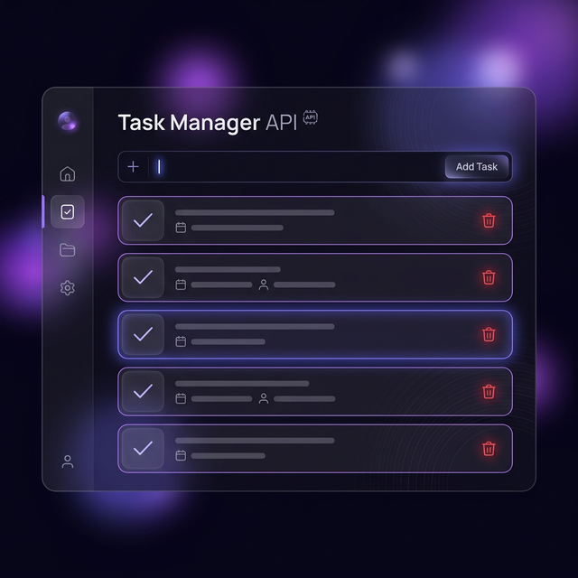

# 🎓 Mini Curso de APIs: Python + Frontend

Este repositório contém todo o código necessário para o **Mini Curso de APIs de 20 minutos**. Aprenda como criar uma API robusta com Python e integrá-la a uma interface moderna!



## 🚀 O que este projeto cobre?

1.  **Conceitos de HTTP**: Entenda na prática GET, POST, PUT e DELETE.
2.  **Backend Moderno**: API criada com **FastAPI** (Python).
3.  **Frontend Dinâmico**: Interface responsiva com **JavaScript (Fetch API)** e **CSS Glassmorphism**.
4.  **Documentação Automática**: Veja sua API em ação com o Swagger UI.

---

## 🧠 O que é uma API?

**API** significa **Application Programming Interface**, ou em português, **Interface de Programação de Aplicações**.

Em palavras simples, uma API é uma forma padronizada de um sistema conversar com outro. Ela define quais pedidos podem ser feitos, quais dados precisam ser enviados e qual tipo de resposta será devolvida.

Podemos quebrar o significado da sigla assim:

- **Application / Aplicação**: é o sistema, site, app ou programa que está sendo usado.
- **Programming / Programação**: são as regras que os desenvolvedores usam para fazer os sistemas conversarem.
- **Interface / Interface**: é o ponto de contato entre duas partes, como uma ponte ou uma tomada com um formato definido.

Uma API não é necessariamente uma tela. Na maioria das vezes, o usuário final nem vê a API diretamente. Quem conversa com ela é outro código: um frontend, um aplicativo mobile, outro servidor ou até uma ferramenta externa.

Por exemplo, quando você abre um aplicativo de clima, a tela do aplicativo provavelmente não calcula a previsão sozinha. Ela faz uma requisição para uma API de clima, recebe os dados e mostra a temperatura, chuva, vento e outras informações para o usuário.

### Pedido e resposta

Uma API funciona muito com a ideia de **requisição** e **resposta**:

1. O frontend faz um pedido para a API.
2. A API recebe esse pedido no backend.
3. O backend executa alguma lógica, como buscar, salvar, alterar ou remover dados.
4. A API devolve uma resposta, geralmente em formato **JSON**.

No nosso projeto, o **frontend** não precisa saber como o Python organiza as tarefas por dentro. Ele apenas faz pedidos para a API, como:

- `GET /tasks`: buscar a lista de tarefas.
- `POST /tasks`: criar uma nova tarefa.
- `PUT /tasks/{id}`: atualizar uma tarefa existente.
- `DELETE /tasks/{id}`: remover uma tarefa.

Esses caminhos, como `/tasks`, são chamados de **endpoints**. Cada endpoint representa uma ação que a API permite executar.

### Como explicar para os alunos

Uma analogia simples é pensar em um restaurante.

Imagine que o cliente está sentado na mesa e quer fazer um pedido. Ele não entra na cozinha, não conversa diretamente com os cozinheiros e não precisa saber como o prato é preparado. Ele usa o cardápio, escolhe o que quer e faz o pedido para o garçom.

- O **cliente** é o frontend, ou seja, a tela que o usuário usa.
- O **garçom** é a API, que leva pedidos e traz respostas.
- A **cozinha** é o backend, onde a lógica acontece.
- O **cardápio** é a documentação da API, mostrando o que pode ser pedido.

Assim como o garçom sabe quais pedidos a cozinha aceita, a API sabe quais endpoints existem e quais dados cada um precisa receber.

Frases para usar na aula:

> Uma API é um combinado de comunicação. Ela define quais pedidos um sistema pode fazer, quais dados precisa enviar e qual resposta vai receber.

> O frontend não precisa saber como o backend funciona por dentro. Ele só precisa saber como conversar com a API.

> API é como uma ponte: de um lado está quem precisa de uma informação; do outro, quem sabe processar e devolver essa informação.

Neste projeto, quando clicamos em botões na tela, o JavaScript conversa com a API em Python. Essa conversa acontece por meio de requisições HTTP.

---

## 🛠️ Tecnologias Utilizadas

- **Python 3.10+**

- **FastAPI** & **Uvicorn**

**Pessoal, para o nosso backend, escolhemos o FastAPI. Ele é "fast" (rápido) tanto na execução quanto na velocidade em que nós, desenvolvedores, conseguimos escrever código. Ele cuida da parte chata, como validação e documentação, para focarmos apenas na lógica da nossa API.**

- **HTML5 / CSS3 (Variáveis & Flexbox)**

- **JavaScript (ES6+)**

---

## 🏃 Como Rodar o Projeto

### 1. Preparar o Backend
Abra o terminal na pasta `backend` e instale as dependências:
```bash
python -m pip install fastapi uvicorn
```

Depois, inicie o servidor:
```bash
python main.py
```
O servidor estará rodando em: `http://localhost:8000`

### 2. Abrir o Frontend
Basta abrir o arquivo `index.html` diretamente no seu navegador.

---

## 📖 Guia de Aprendizado

- **main.py**: Contém toda a lógica do servidor. Explore os comentários numerados!
- **script.js**: Veja como o JavaScript "conversa" com o Python usando o método `fetch`.
- **docs**: Com o servidor rodando, acesse `http://localhost:8000/docs` para testar os endpoints interativamente.

---

## 📝 Licença
Este projeto é para fins educacionais. Sinta-se à vontade para usar e modificar!

Desenvolvido para o **Mini Curso de APIs**.
